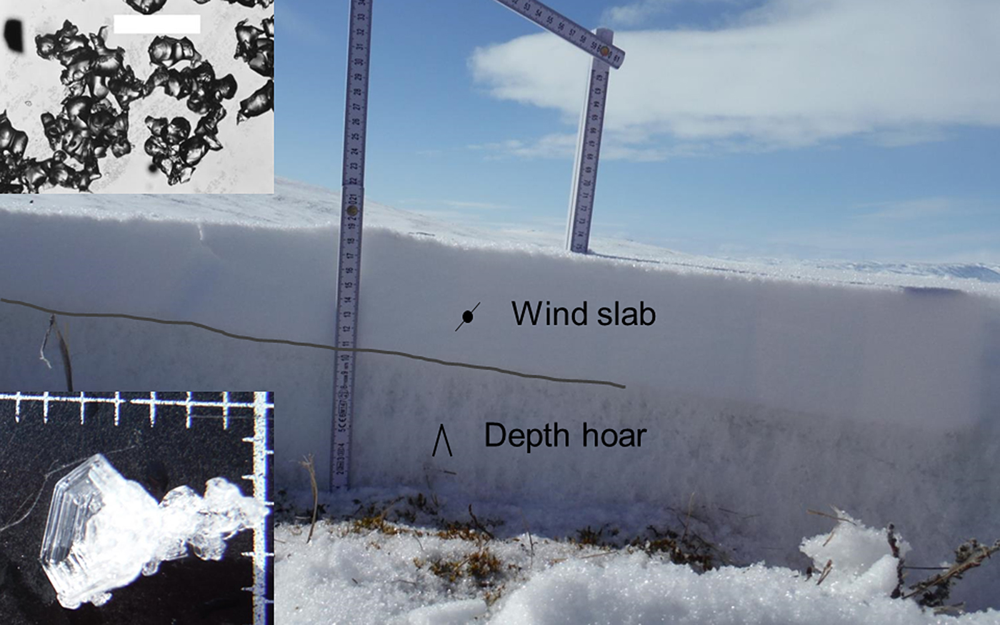

## Snow cover heterogeneity and its impact on the Climate and Carbon cycle of Arctic regions

- ESA Climate Change Initiative Fellowship: https://climate.esa.int/en/about-us-new/fellowships/esa-cci-research-fellowship-Mickael-Lalande/
- Durantion: 2-years postdoc project (from 01/10/2023 to 30/09/2025) 
- Supervised by: [Christophe Kinnard](https://oraprdnt.uqtr.uquebec.ca/pls/public/gscw045a.afficher_detail_form_reponse?owa_no_site=5528&owa_bottin=&owa_no_fiche=3&owa_no_form_reponse=221924&owa_apercu=N&owa_imprimable=N&owa_brouillon=N&owa_fenetre_surgissante=N&owa_lettre=%25&owa_no_page=1) and [Alexandre Roy](https://oraprdnt.uqtr.uquebec.ca/pls/public/genw050r.page_perso?owa_no_personne=730015) 
- Location: [UQTR](https://www.uqtr.ca/index.shtml) / [RIVE](https://oraprdnt.uqtr.uquebec.ca/pls/public/gscw031?owa_no_site=2137) / [GLACIOLAB](https://oraprdnt.uqtr.uquebec.ca/pls/public/gscw031?owa_no_site=5528) (Trois-Rivières, Canada)

### Abstract

One of the current limitations of the Canadian Land Surface Scheme including Biogeochemical Cycles (CLASSIC) is the use of a single-layer snow scheme that does not account for typical Arctic snowpack processes (such as increased wind compaction or blowing snow sublimation losses) and without an explicit parameterization for the snow cover fraction (SCF). However, blowing snow sublimation losses are significant in the Arctic, and snowpacks are typically characterized by at least two typical snow layers (e.g., a base depth hoar layer overlain by a wind slab), which have distinct physical characteristics (Fig. 1).

_Figure 1: Typical vertical section of the Arctic snowpack at Bylot Island in May 2015 (from Domine et al., [2018](https://www.cambridge.org/core/journals/journal-of-glaciology/article/soil-moisture-wind-speed-and-depth-hoar-formation-in-the-arctic-snowpack/A7A58A639BD2BD079F1D45E2401CFCB1))._

Moreover, the snow cover varies greatly at typical scales, ranging from 10 to 100 meters (due to snow–canopy interactions, snow redistribution by wind, and pronounced microtopography, etc.), to larger scales (>1 km) due to climatic and/or orographic gradients. A poor representation of the spatial heterogeneity of these ‘snowscapes’ within continental-scale land surface models (LSMs) and catchment-scale hydrological models can lead to biased snow cover and runoff simulations, thereby compromising projections under climate change scenarios. As such, measuring and understanding snow cover heterogeneity and representing it within process-based models represents one of the greatest ongoing challenges in atmospheric and hydrological sciences, which calls for innovative efforts to address this issue. 

**The SnowC$^2$ project aims to improve our understanding of the spatial heterogeneity of the snow cover in Arctic regions and its representation within process models for more robust simulations of snow cover conditions and surface energy and carbon fluxes under current and future climates.**

To that purpose, we improved the CLASSIC snow model, with a particular focus on Arctic environments. Key snow model improvements include the addition of blowing snow sublimation losses, a new snow compaction scheme, and parameterization of snow thermal conductivity. Evaluations at seven mid-latitude and alpine sites  (SnowMIP sites) and three Arctic sites (Bylot Island, Umiujaq, and Trail Valley Creek) demonstrate that these enhancements improve the overall simulated snowpack characteristics and soil temperatures across both SnowMIP and Arctic sites (Lalande et al., *in prep*). 

Future model developments will focus on spatial scale simulation across the entire Arctic, with particular attention to snow cover fraction parameterizations to better account for spatial heterogeneities. The influence of these new developments will be assessed against the evolution of the Snow CCI variables for different land types and for the simulated surface energy and carbon fluxes. This work is being done in collaboration with ECCC.

---

Project link: https://climate.esa.int/en/about-us-new/fellowships/esa-cci-research-fellowship-Mickael-Lalande/

